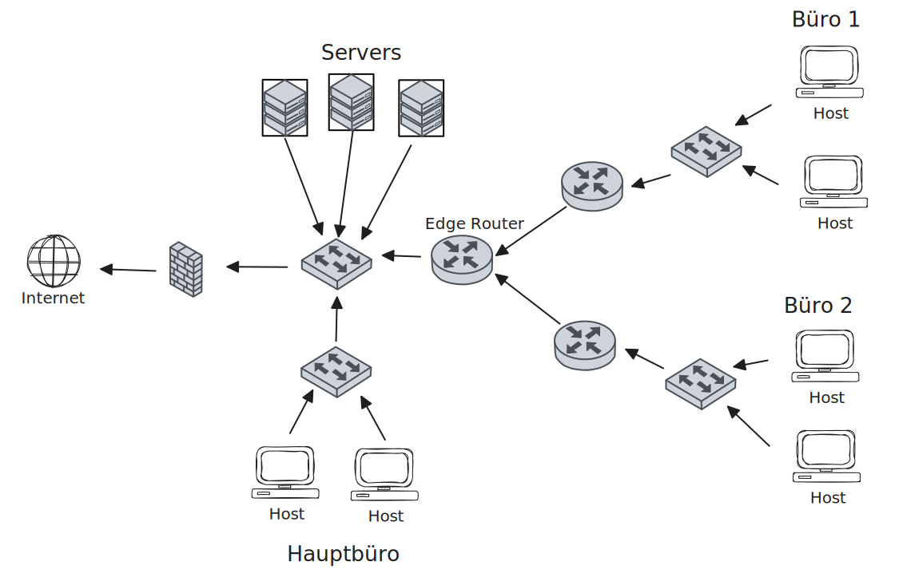
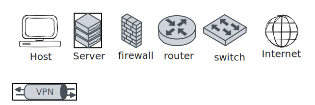
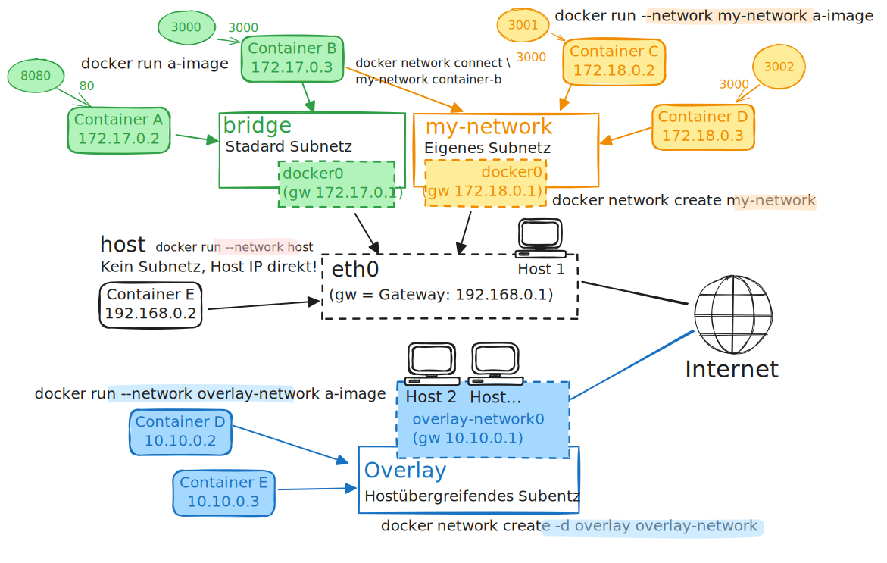
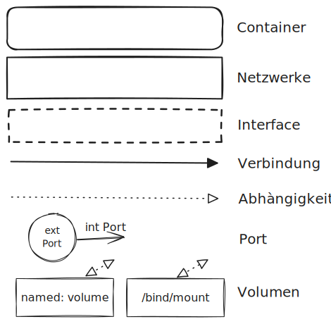

# Docker Network - Diagramme

## Netzwerk Diagramme

1. Es gibt **keinen wirklichen Standard**.
2. Es gibt Icons von Cisco, AWS, ...
3. **Physikalische** Diagramme: beschreiben **Hardware**.
4. **Logische** Diagramme: beschreiben **Zusammenhänge**.

## Tools

Im Unterricht wird [Excalidraw](https://excalidraw.com/) verwendet. Dies gibt es
auch als
[VS-Code Plugin](https://marketplace.visualstudio.com/items?itemName=pomdtr.excalidraw-editor).
Dazu verwende ich die Library
[Network topology icons](https://libraries.excalidraw.com/?target=_excalidraw&referrer=https%3A%2F%2Fexcalidraw.com%2F&useHash=true&token=2ff2V9EsBKo_Vl0s6oQ2v&theme=light&version=2&sort=default#dwelle-network-topology-icons)

Alternativen wären:

- [draw.io](https://app.diagrams.net/)
- [tldraw](https://tldraw.dev/)

## Physikalische Netzwerk Diagramme

### Legende

## Logische Netzwerk Diagramme

### Legende

