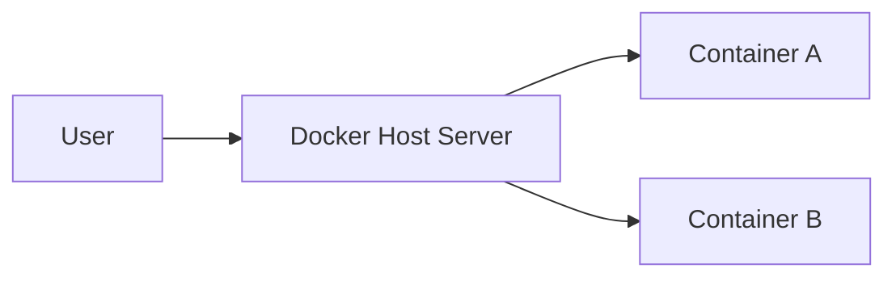
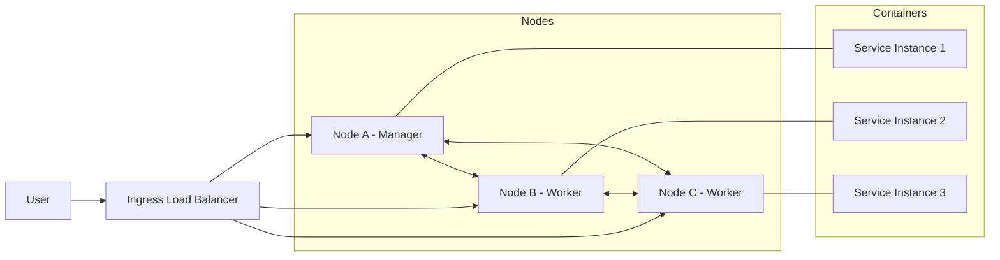
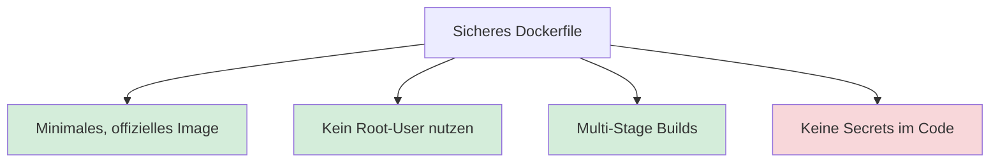

<!-- _class: big center -->

# Docker Swarm Mode

## Modul 169

---

# Inhalt

:::columns

- **Repetition**
- **Von Compose zu Swarm Mode**

:::

---

<!-- _class: big center -->

# Regeln 👮‍♀️

---

# §1 Fokus und Geräte

Die **digitalen Geräte**: 📱, 💻, etc.

- immer nur auf **Aufforderung der Lehrkraft**
- immer nur zur **Bearbeitung der gestellten Aufgaben**

**Private Aktivitäten sind untersagt**: _unter anderem Social Media, Spiele,
Videos, private E-Mails/Chats, Surfen, Shoppen, etc._

---

# §2 Ruhe und Umgangsformen

Die Konzentration der Mitschüler muss gewährleistet sein.

- **Lärm ist zu vermeiden**<br/> z.B. laute Gespräche, Geräusche, Rufen.

- **Freundlicher, höflicher und respektvoller** Umgangston

---

<!-- _class: big -->

## Repetition

# Was ist Docker Compose?

---

# Was ist Docker Compose?

✅ Definiert **Multi-Container-Anwendungen** in einer YAML-Datei.

- **Fokus:** Lokale Entwicklung & Einzel-Host.
- **CLI:** `docker compose <command>` + `docker-compose.yml`.
- **Limit:** Wenn der Server ausfällt, ist die Anwendung offline.

---

# Docker Compose (Single Host)



---

# Was ist Docker Swarm Mode?

✅ Definiert **Multi-Container-Anwendungen** in einer YAML-Datei.

✅ **Verbindet mehrere Docker-Hosts zu einem virtuellen Cluster**.

- **Fokus:** Hochverfügbarkeit & Produktion.
- **CLI:** `docker swarm init` + `docker swarm join`
  - `docker stack deploy` + `docker-stack.yml`.
- **Limit:** Unterstütz **kein build**, nur fertige Images

---

# Docker Swarm Mode (Multi Host)



---

<!-- _class: grid-table-3 -->

# Die Hautpunterschiede

| Feature         | Docker Compose      | Docker Swarm (Stack)        |
| :-------------- | :------------------ | :-------------------------- |
| **Datei**       | docker-compose.yml  | docker-stack.yml            |
| **Befehl**      | `docker compose up` | `docker stack deploy`       |
| **Replikation** | Manuell             | Deklarativ via `replicas`   |
| **Skalierung**  | Einzelner Host      | Über den gesamten Cluster   |
| **Builds**      | Erlaubt `build: .`  | **Benötigt fertige Images** |

---

# YAML Erweitern für Swarm

```yaml
services:
  web:
    image: my-app:latest
    deploy: # <--- Spezifisch für Swarm
      replicas: 3
      restart_policy:
        condition: on-failure
      update_config:
        parallelism: 1
        delay: 10s
```

---

# 📝 Auftrag

::: columns l60

Zusammen erarbeiten wir die Aufgabe "Docker Voting App"

- [Docker Voting App](https://michisalm.github.io/modul-169-website/docs/woche08/docker-voting-app)

::: split

- :dna: Zusammen
- :clock1: 20 min

:::
<<<<<<< HEAD
<<<<<<< HEAD

---

<!-- _class: big center -->

# Security

---

# Dockerfile



---

# Minimales, offizielles Image

::: columns r60

## Minimal

```dockerfile
FROM node:20-alpine
WORKDIR /app
COPY package*.json ./
RUN npm install --production
COPY . .
CMD ["node", "index.js"]
```

💡 Weniger Programme, weniger Angriffsfläche.

::: split

## Ubuntu mit node installiert

```dockerfile
FROM ubuntu:22.04
RUN apt-get update && apt-get install -y \
    curl \
    gnupg \
    && curl -fsSL https://deb.nodesource.com | bash - \
    && apt-get install -y nodejs && apt-get clean \
    && rm -rf /var/lib/apt/lists/*
WORKDIR /app
COPY package*.json ./
RUN npm install
COPY . .
CMD ["node", "index.js"]
```

:::

---

# Kein Root-User nutzen

```dockerfile
FROM ubuntu:22.04
RUN apt-get update && apt-get install -y curl \
    && curl -fsSL https://deb.nodesource.com | bash - \
    && apt-get install -y nodejs && rm -rf /var/lib/apt/lists/*
# Eigenen Benutzer und Gruppe anlegen und verwenden
RUN adduser --system --group --home /home/appuser appuser
WORKDIR /app
RUN chown appuser:appuser /app # Rechte setzen
USER appuser # User appuser verwenden
COPY --chown=appuser:appuser package*.json ./ # Berechtigungen geben
RUN npm install --production
COPY --chown=appuser:appuser . .
CMD ["node", "index.js"] # App starten
```

- :bulb: Wehniger Rechte ist immer sicherer!

---

# Minimale Images haben oft einen User parat

```dockerfile
FROM node:20-alpine

# Verzeichnis erstellen und Berechtigungen setzen
RUN mkdir -p /home/node/app && chown -R node:node /home/node/app
WORKDIR /home/node/app

# Zum Nicht-Root-Benutzer wechseln
USER node

# Dateien kopieren und dabei direkt den Besitzer ändern (--chown)
COPY --chown=node:node package*.json ./
RUN npm install

COPY --chown=node:node . .

CMD ["node", "index.js"]
```

---

# Multistage verkleinert produktives Image

```dockerfile
FROM node:20 AS builder
WORKDIR /app
COPY package*.json ./
COPY server.js ./
RUN npm install

# Stage 2: Production stage "slim!"
FROM node:20-slim
WORKDIR /app
COPY --from=builder /app .
EXPOSE 3000
CMD ["npm", "start"]
```

- :bulb: Weniger Programme, weniger Angriffsfläche.

---

# Keine Secrets im Code

::: columns l60

### ✅ Richtig

```bash
# Datei mit Secret erstellen, Achtung: Bash-History leeren!
echo "MY_PASSWORD=super-geheim-123" > .env.secret

# Container starten und die Datei einbinden
docker run -d \
  --name meine-app \
  --env-file .env.secret \
  mein-node-image
```

- Secrets werden als ENV-Vars in den **Container beim Starten** geladen.
- `*.secret` ins `.gitignore`.

::: split

### 🚨 Falsch

```dockerfile
FROM node:20-alpine
# 🚨 PIIIP Falsch!
ENV MY_PASSWORD="super-geheim-123"
```

- **NIE** als ENV im Dockerfile
- **NIE** in git eingecheckt!

:::

---

# 👮‍♀️ Supersicher → fnox

```bash
fnox init
# Ein Secret verschlüsselt hinzufügen (wird in fnox.toml gespeichert)
fnox set DB_PASSWORD "mein-super-geheimes-passwort"

# fnox entschlüsselt DB_PASSWORD und übergibt es an Docker
fnox exec -- docker run -d \
  --name meine-app \
  -e DB_PASSWORD \
  mein-node-image
```

- Dadurch ist das Passwort auch auf der Maschine nicht in Klartext vorhanden und
  könnte sogar in git eingecheckt werden.
- Mehr auf [fnox](https://fnox.jdx.dev/)

---

# Secrets mit docker-compose.yml

```bash
# Datei mit Secret erstellen, Achtung: Bash-History leeren!
echo "MY_PASSWORD=super-geheim-123" > .password.txt
```

```yaml
services:
  app:
    image: mein-node-image
    secrets:
      - db_password

secrets:
  db_password:
    file: ./password.txt
```

---

# 📖 Auftrag

::: columns l60

Lesen Sie "Docker Security" von der Woche 8

- [Docker Security](https://michisalm.github.io/modul-169-website/docs/woche08/docker-security)

::: split

- :dna: Einzelarbeit
- :clock1: 15 min

:::

---

# 📝 Auftrag


::: columns l60

Gehen Sie durch alle `Dockerfile` Aufgaben durch und versuchen Sie mit KI Ihrer
wahl die Aufgaben sicherer zu machen.

::: split

- :dna: Einzelarbeit
- :clock1: 15 min

:::
=======
>>>>>>> 8e48e38 (docs: woche04 security)
=======
>>>>>>> 8e48e38 (docs: woche04 security)
